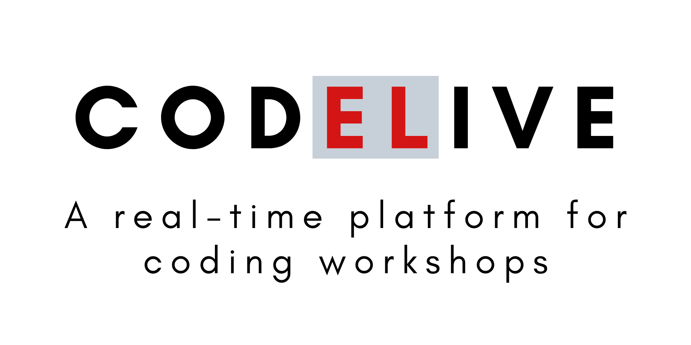

<p align='center'>
  
</p>

---

[](https://madhavarshney.github.io/codive)
[](https://github.com/madhavarshney/codive/issues)
[](https://github.com/madhavarshney/codive/stargazers)
[](https://github.com/madhavarshney/codive/network)

<!-- [](https://github.com/madhavarshney/codive/releases) -->
<!-- [](https://github.com/madhavarshney/codive/actions?query=workflow%3ACI) -->
<!-- [](https://github.com/madhavarshney/codive/blob/master/LICENSE) -->


Codive is a live real-time collaboration platform for hosting workshops and collectively teaching groups how to code.

## Features
_More on this will come soon._

## Development

### Introduction

Codive has two frontend implementations, one written in React-like [HyperApp](https://hyperapp.dev/) and the other written in [Svelte](https://svelte.dev/). For the backend, Codive currently uses [Firebase](https://firebase.google.com/).

### Prerequisites
- Install [Node.js](https://nodejs.org/) and npm
- Set up a [Firebase project](https://console.firebase.google.com/)

### Setup

```bash
git clone https://github.com/madhavarshney/codive.git
cd codive
```

Download your firebase config for the web and rename + move it to `./firebaseConfig.js`

### Starting Codive

Note: Currently, the Svelte version is more up-to-date compared to the HyperApp version.

#### Svelte

```bash
cd codive-svelte
npm i
npm run dev
```

Go to https://localhost:8080

#### Hyperapp

```bash
cd codive-react
npm i
npm run start
```

Go to https://localhost:1234

## Roadmap

- [ ] Create a roadmap

## License

The code in this repo is licensed under the MIT license.

_To be continued..._
